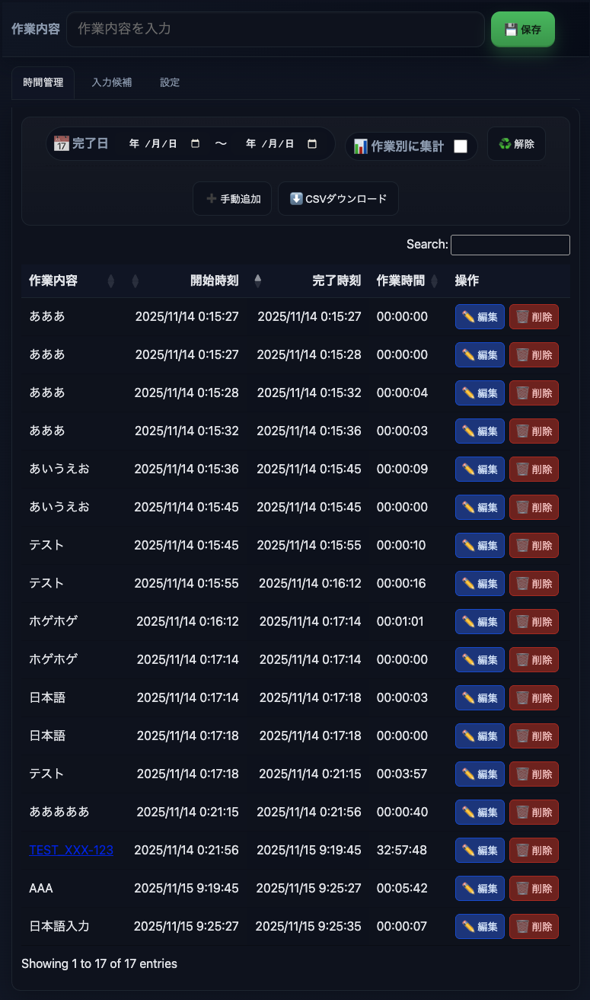

# 完了時刻管理 Progressive Web App
「今まで何してたか？」を完了タイミングで書き込むだけで、勝手に作業時間を集計してくれるツール

URL: https://ciderh2co3.github.io/doneTime/

## 使い方
### 毎日の使い方

1. 作業を始めるときに、「作業内容」に「開始」を入力し、保存
2. 作業が終わるたびに、「作業内容」にやってた作業を入力し、保存
3. 休憩が終わったら、「作業内容」に「休憩」を入力し、保存
4. そうして最後まで作業を入力する

### 集計時の使い方

1. 「完了日」で範囲を絞り込む
2. 必要に応じて、「作業別に集計」で作業をまとめて集計したり、「作業時間」順に並べ替えたりしながら確認する
3. 別アプリで細かい計算がしたくなったら、「CSVダウンロード」でダウンロードする

### 便利な使い方

* 時間を間違えた際は、「手動追加」「変更」「削除」できる
  * 「作業終わったあと更新忘れてた......」のようなときに活用できる
* 「作業内容」のプルダウンは、直近で入力した内容が反映される
  * プルダウンの内容は、「入力候補」タブから削除・ピン留め可能
* よくあるバク管理IDなどを入力すると、URLに変換できる
  * 「設定」からバグ管理システムのURLテンプレートを設定する
* インストール可能なPWAで作成されているため、Webアプリとしてインストール可能
  * OS上アプリとして表示できるが、実質Webアプリのため、制約の厳しい環境でも動作可能
  * 作業内容の保存先はブラウザのローカルストレージのみのため、セキュリティ的にも安心
  * (逆に複数端末間でのデータの共有などはできないので、CSV出力などを活用して集計すること)
